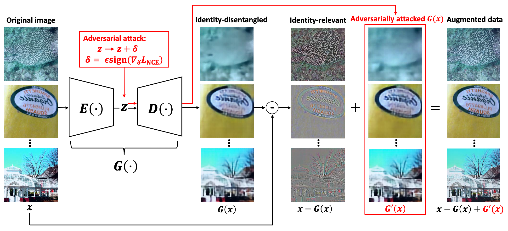

# IDAA

Official implementation:
- Identity-Disentangled Adversarial Augmentation for Self-Supervised Learning, ICML 2022. ([Paper](https://proceedings.mlr.press/v162/yang22s/yang22s.pdf))

For questions, you can contact (kwyang@mail.ustc.edu.cn).

<div align="center">
  
  <p>Architecture and pipeline of Identity-Disentangled Adversarial Augmentation (IDAA)</p>
</div>

## Requirements

1. [Python](https://www.python.org/)
2. [Pytorch](https://pytorch.org/)
3. [Wandb](https://wandb.ai/site)
4. [Torchvision](https://pytorch.org/vision/stable/index.html)
5. [Apex(optional)](https://github.com/NVIDIA/apex)

## Pretrain a VAE


```
python train_vae.py --dim 512 --kl 0.1 --save_dir ./results/vae_cifar10_dim512_kl0.1_simclr --mode simclr --dataset cifar10
```

## Apply IDAA to SimCLR
```
cd SimCLR
```

SimCLR training and evaluation:
```
python main.py --seed 1 --gpu 0  --dataset cifar10 --resnet resnet18;
python eval_lr.py --seed 1 --gpu 0 --dataset cifar10 --resnet resnet18
```
SimCLR+IDAA training and evaluation:
```
python main.py --adv --eps 0.1 --seed 1 --gpu 0 --dataset cifar10 --dim 512 --vae_path ../results/vae_cifar10_dim512_kl0.1_simclr/model_epoch292.pth --resnet resnet18;
python eval_lr.py --adv --eps 0.1 --seed 1 --gpu 0 --dataset cifar10 --dim 512 --resnet resnet18
```

## References
We borrow some code from https://github.com/chihhuiho/CLAE.


## Citation

If you find this repo useful for your research, please consider citing the paper
```
@InProceedings{pmlr-v162-yang22s,
  title = 	 {Identity-Disentangled Adversarial Augmentation for Self-supervised Learning},
  author =       {Yang, Kaiwen and Zhou, Tianyi and Tian, Xinmei and Tao, Dacheng},
  booktitle = 	 {Proceedings of the 39th International Conference on Machine Learning},
  pages = 	 {25364--25381},
  year = 	 {2022},
  editor = 	 {Chaudhuri, Kamalika and Jegelka, Stefanie and Song, Le and Szepesvari, Csaba and Niu, Gang and Sabato, Sivan},
  volume = 	 {162},
  series = 	 {Proceedings of Machine Learning Research},
  month = 	 {17--23 Jul},
  publisher =    {PMLR},
  pdf = 	 {https://proceedings.mlr.press/v162/yang22s/yang22s.pdf},
  url = 	 {https://proceedings.mlr.press/v162/yang22s.html},
  abstract = 	 {Data augmentation is critical to contrastive self-supervised learning, whose goal is to distinguish a sample’s augmentations (positives) from other samples (negatives). However, strong augmentations may change the sample-identity of the positives, while weak augmentation produces easy positives/negatives leading to nearly-zero loss and ineffective learning. In this paper, we study a simple adversarial augmentation method that can modify training data to be hard positives/negatives without distorting the key information about their original identities. In particular, we decompose a sample $x$ to be its variational auto-encoder (VAE) reconstruction $G(x)$ plus the residual $R(x)=x-G(x)$, where $R(x)$ retains most identity-distinctive information due to an information-theoretic interpretation of the VAE objective. We then adversarially perturb $G(x)$ in the VAE’s bottleneck space and adds it back to the original $R(x)$ as an augmentation, which is therefore sufficiently challenging for contrastive learning and meanwhile preserves the sample identity intact. We apply this “identity-disentangled adversarial augmentation (IDAA)” to different self-supervised learning methods. On multiple benchmark datasets, IDAA consistently improves both their efficiency and generalization performance. We further show that IDAA learned on a dataset can be transferred to other datasets. Code is available at \href{https://github.com/kai-wen-yang/IDAA}{https://github.com/kai-wen-yang/IDAA}.}
}
```
